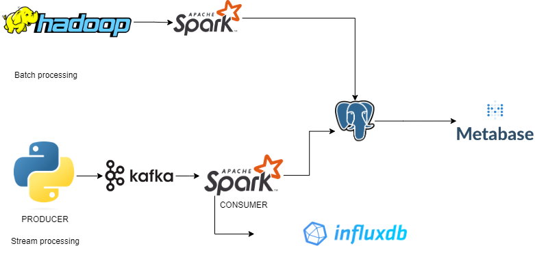

# Traffic Monitoring Project

This project aims to monitor and analyze traffic data in real-time and batch processing mode. The architecture is based on Apache Spark, HDFS, Spark Streaming, Apache Kafka, InfluxDB, PostgreSQL, Metabase. The project is divided into three main components:

1. **Batch Processing**: This component is responsible for ETL processes, loading data from HDFS, transforming it, and saving it to PostgreSQL. It also includes SQL queries used for creating dashboards and visualizations with Metabase.
2. **Environment**: This component provides Docker Compose and other configuration files necessary for setting up the infrastructure for the project.
3. **Streaming**: This component implements a Kafka producer to simulate car traffic data (latitude, longitude, and speed). The Spark Streaming processes this data and writes it to InfluxDB and PostgreSQL.

## Project Architecture

## Installation and Setup

To set up the project, follow these steps:

1. Clone the repository: `git clone`
2. Change to the project directory: `cd traffic-monitoring`
3. Set up the environment using Docker Compose: `cd environment; docker-compose up -d`
4. Follow the instructions in each component's README file to run and test the application.

## Folder Structure

- `batch_processing`: Contains ETL process, HDFS loading, data transformation, and saving to PostgreSQL. It also includes the SQL queries used for creating dashboards with Metabase.
- `environment`: Includes the Docker Compose file and other configuration files necessary for setting up the infrastructure for the project.
- `streaming`: Contains the Kafka producer and Spark Streaming code to process the data coming from simulated car traffic.

For more details, please refer to each folder's README file.

## License

[MIT License](LICENSE)
